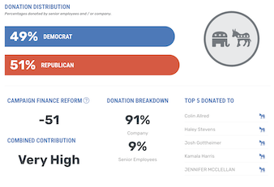
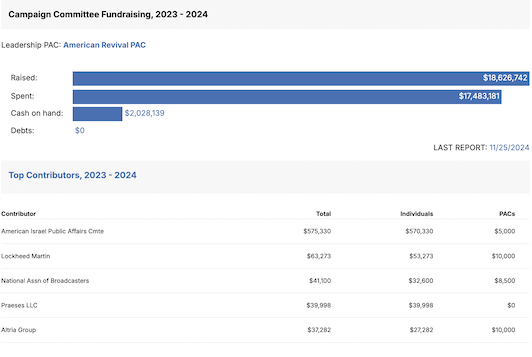

**Completed a task? Great! Move to [Step 4](/recover)**

# Tools & Actions

Table of Contents
- [What Are Your Organizations Suggesting?](#what-are-your-organizations-suggesting)
- [Contact Your Representative](#contact-your-representatives)
- [Volunteer](#volunteer)
- [Register to Vote](#register-to-vote)
- [Donate](#donate)
- [Find Politics of Brands](#analyze-where-you-are-spending-your-money)
- [Learning / Education](#learning--education)

## What Are Your Organizations Suggesting?
Explore the websites and social media pages for organizations that support your cause. They are on the front lines so they will likely know what you should do! Look for clear actions that you can take. 

## Contact Your Representatives
Make your voice heard! Write to or call your representatives at the local, state, and national level. Urge them to take up your cause, or call them out on stances you disagree with. Every email, letter, or message is counted and is an **important** indicator that 

- [ResistBot](https://resist.bot)

  Resistbot is a chatbot that turns your texts into faxes, postal mail, or emails to your representatives in minutes.
  
  

    
  

  Send the word `RESIST` to Resistbot on 
  [Apple Messages](https://bcrw.apple.com/sms:open?service=iMessage&recipient=urn:biz:d0189b65-f844-4344-adc1-d2d01daca04e&body=resist), 
  [Messenger](https://www.messenger.com/t/1224106861035505?text=resist), 
  [Instagram](https://www.instagram.com/direct/t/107534807309194/?text=), 
  [Telegram](https://t.me/resistbot?start=resist), 
  or by text to `50409` and answer the questions texted back. In minutes, you’ll have contacted Congress or your other elected officials. [Make your letter open](https://resist.bot/letters) for maximum effect.

  ---

- [Find Your Elected Officials](https://www.usa.gov/elected-officials)

  USA.gov has a tool to to find your Federal, State, and Local officials, just enter your address. They provide a **physical address**, **phone numbers**, and **social media accounts** for every elected official. 

  ---

- [Find Your Congress Members](https://www.congress.gov/members/find-your-member) 

  Congress.gov: Enter your address to find your Senate and House representatives.

## Volunteer
- Check if your cause or organization has volunteer openings or memberships. 

  ---

- [VolunteerMatch.org](https://www.volunteermatch.org/)

  VolunteerMatch believes that volunteering can change lives – starting with yours. When we connect with our communities and each other through service we can find our passion and purpose, build camaraderie and hope, and experience joy and gratitude.

  ---
  
- [Volunteer as a Poll Worker](https://www.eac.gov/help-america-vote)

  Poll workers are essential to ensure elections are a success. During each election, millions of Americans dedicate themselves to sustaining the backbone of democracy - our election process.

## Register to Vote 
Register or check your registration status and find out what issues are on your ballot.
- [Vote.org](https://www.vote.org/)

  ---
- [Vote Like A Beast](https://www.votelikeabeast.com/)

## Donate 
- Check if your chosen cause or organization is accepting donations and find out if they have an annual or monthly membership. 

- [Charity Navigator](https://www.charitynavigator.org/)

  Charity Navigator helps millions of people take action and support the causes they care about by connecting them to the best charities that align with their passions and values.

  ---

- [Give.org](https://give.org/) 

  Give.org's mission: "To strengthen public confidence in charities by promoting wise giving and trustworthy charity practices". They use a standards-based charity evaluator that seeks to verify the trustworthiness of publicly-soliciting charities by completing rigorous evaluations. 

## Analyze Where You Are Spending Your Money
For better, or for worse, some companies and politicians only seem to respond to boycotts or an increase in sales. So wield your purchasing power carefully! 

Find companies who align with your cause and support them. 

Find companies that don't support your cause and spend your money at alternative companies.

- [Goods Unite Us](https://www.goodsuniteus.com/)
  
  Search for a company and see their politics. Do some research and spend your money wisely!

  

- [Open Secrets](https://www.opensecrets.org/)

  Look up a politician to see who is funding their campaign. Look up a company to see who and where they are making donations to. 

  

## Learning / Education
It's important to actively learn about the issues you are passionate about. Consider taking a class, read a book, or do a project that will immerse yourself into your cause.

These are just a few examples. Do some research to find opportunities near you or about what you are interested in. 

- [WebAIM Accessibility Training Courses](https://webaim.org/services/training/)

- Online Courses, Certifications
  - [Harvard Free Courses](https://pll.harvard.edu/catalog/free?page=1)
    - [Women Making History: Ten Objects, Many Stories](https://pll.harvard.edu/course/women-making-history-ten-objects-many-stories)
    - [Justice](https://pll.harvard.edu/course/justice)
  - [OSU Online](https://online.osu.edu/)
    - [Black Studies Certificate](https://online.osu.edu/undergraduate-certificates/black-studies-certificate/)
    - [Diversity, Equity, and Inclusion Certificate](https://online.osu.edu/undergraduate-certificates/diversity-equity-inclusion-certificate/)
  - [MIT OpenCourseWare](https://ocw.mit.edu/)
    - [Congress and the American Political System I](https://ocw.mit.edu/courses/17-251-congress-and-the-american-political-system-i-fall-2016/)
    - [Science Activism: Gender, Race, and Power](https://ocw.mit.edu/courses/wgs-160j-science-activism-gender-race-and-power-fall-2019/)
    - [Data Storytelling Studio: Climate Change](https://ocw.mit.edu/courses/cms-631-data-storytelling-studio-climate-change-spring-2017/)

- Books (Physical or Audio)
  - [The Truth About Immigration](https://us.macmillan.com/books/9781250288240/thetruthaboutimmigration/)
  - [Books on Racism](https://www.powells.com/featured/antiracism)
  - [Books by Trans Authors](https://glaad.org/eight-books-from-trans-authors-to-read-for-trans-awareness-week/)
  - [Books on Accessibility](https://www.goodreads.com/shelf/show/accessibility)

  ---

   
**Completed a task? Great! Move to [Step 4](/recover)**