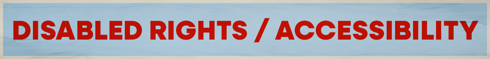

Want to pick Disabled Rights / Accessibility as your cause? Great! Move to [step 2](../../steps/step2/README.md).

# Organizations

## 🌍 International

- [International Association of Accessibility Professionals](https://www.accessibilityassociation.org/s/)

  A global association of organizations and professionals that have joined together to define, promote, and improve the accessibility of services, products, and environments for people with disabilities. Become part of the Global Accessibility Community.

  ---

- [WebAIM](https://webaim.org/)

  We have web accessibility in mind. Expanding the potential of the web for people with disabilities by empowering individuals and organizations to create accessible content.

## 🇺🇸 U.S. Focused

- [Disability Rights Education & Defense Fund](https://dredf.org/)

  We envision a just world where all people, with and without disabilities, live full and independent lives free of discrimination. Disability Rights Education and Defense Fund (DREDF), founded in 1979, is a leading national civil rights law and policy center directed by individuals with disabilities and parents who have children with disabilities.

    <a href="https://bsky.app/profile/dredf.bsky.social" title="Follow on BlueSky Social">🦋 Follow</a>

    ---

- [American Association of People with Disabilities](https://www.aapd.com/)

  The American Association of People with Disabilities works to increase the political and economic power of people with disabilities. As a national disability-led and cross-disability rights organization, AAPD advocates for full civil rights for over 70 million Americans with disabilities.

  ---

- [ADA National Network](https://adata.org/)

  The ADA National Network provides information, guidance and training on how to implement the Americans with Disabilities Act (ADA) in order to support the mission of the ADA to “assure equality of opportunity, full participation, independent living, and economic self-sufficiency for individuals with disabilities.”

  To contact a specialist call [1-800-949-4232](tel:18009494232)

  <a href="https://bsky.app/profile/adata.org" title="Follow on BlueSky Social">🦋 Follow</a>

  ---

***A note about BlueSky:** I am providing links to BlueSky because it's algorithms are open source and transparent. Don't like your feed? You can create your own or find a feed created by a fellow user.

I encourage you to use social media platforms that are open sourced and decentralized (like [BlueSky](https://bsky.app/) or [Mastodon](https://joinmastodon.org/)). However, your organization might not have an account on these newer platforms, so go where your orgs are. 