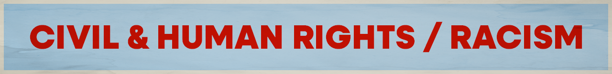

Want to pick Civil & Human Rights / Racism as your cause? Great! Move to [step 2](../../steps/step2/README.md).

# Organizations

## 🌍 International

- [Amnesty International](https://www.amnesty.org/)

  Through our detailed research and determined campaigning, we help fight abuses of human rights worldwide. We bring torturers to justice. Change oppressive laws. And free people jailed just for voicing their opinion.

  <a href="https://bsky.app/profile/did:plc:2i2ayysyi5ejqdzon2a6rais" title="Follow on BlueSky Social">🦋 Follow</a>

## 🇺🇸 U.S. Focused

- [ACLU](https://www.aclu.org/)

  With immigrant rights, trans justice, reproductive freedom, and more at risk, we’re in courts and communities across the country to protect everyone’s rights — and we need you with us.

    <a href="https://bsky.app/profile/did:plc:bg5vuqejktlwjgcdsm3jyv73" title="Follow on BlueSky Social">🦋 Follow</a>
  
  ---

- [Equal Justice Initiative](https://eji.org/)

  The Equal Justice Initiative is committed to ending mass incarceration and excessive punishment in the United States, to challenging racial and economic injustice, and to protecting basic human rights for the most vulnerable people in American society.

  <a href="https://bsky.app/profile/did:plc:3uqcrs5wxdb6c6kjmlr534ep" title="Follow on BlueSky Social">🦋 Follow</a>

  ---
  
- [Southern Poverty Law Center](https://www.splcenter.org/)
  
  With your help, we’re standing up for the most vulnerable people in society – those who have no other champion. We’re exposing hate and injustice, fighting discrimination, and providing award-winning anti-bias materials – free of charge – to schools across America.

    <a href="https://bsky.app/profile/did:plc:w4f6uyyiucht2wi6p74pzxti" title="Follow on BlueSky Social">🦋 Follow</a>
  
  ---

- [NAACP](https://www.naacp.org/)

  We envision an inclusive community rooted in liberation where all persons can exercise their civil and human rights without discrimination. We are committed to a world without racism where Black people enjoy equitable opportunities in thriving communities.

  ---

- [Native American Rights Fund](https://narf.org/)

  The Native American Rights Fund holds governments accountable. We fight to protect Native American rights, resources, and lifeways through litigation, legal advocacy, and legal expertise. Providing legal assistance to Native American tribes, organizations, and individuals nationwide.

  ---

- [National Congress of American Indians](https://www.ncai.org/)
  NCAI, a non-profit organization, advocates for a bright future for generations to come by taking the lead to gain consensus on a constructive and promising vision for Indian Country.

  ---

- [Innocence Project](https://innocenceproject.org/)

  Founded in 1992 by visionary attorneys Peter Neufeld and Barry Scheck, the Innocence Project has been at the forefront of criminal justice reform, using DNA and other scientific advancements to prove wrongful conviction.

  <a href="https://bsky.app/profile/innocenceproject.bsky.social" title="Follow on BlueSky Social">🦋 Follow</a>

  ---
***A note about BlueSky:** I am providing links to BlueSky because it's algorithms are open source and transparent. Don't like your feed? You can create your own or find a feed created by a fellow user.

I encourage you to use social media platforms that are open sourced and decentralized (like [BlueSky](https://bsky.app/) or [Mastodon](https://joinmastodon.org/)). However, your organization might not have an account on these newer platforms, so go where your orgs are.  