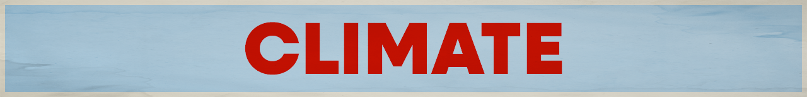

Want to pick Climate as your cause? Great! Move to [step 2](../../steps/step2/README.md).

# Organizations

## 🌍 International

- [Climate Action Network](https://climatenetwork.org/)

  Climate Action Network (CAN) is the world’s largest climate network made up of more than 1,900 civil society organisations in over 130 countries, together fighting the climate crisis.

  <a href="https://bsky.app/profile/caneurope.bsky.social" title="Follow on BlueSky Social">🦋 Follow</a>

## 🇺🇸 U.S. Focused

- [Climate Science Legal Defense Fund](https://climatesciencedefensefund.org/)

  Our work ensures that scientists can conduct, publish, and discuss their research and advocate for science without the threat of political harassment, censorship, or legal intimidation.

  <a href="https://bsky.app/profile/csldf.org" title="Follow on BlueSky Social">🦋 Follow</a>

  ---

- [Citizens' Climate Lobby](https://citizensclimatelobby.org/)

  Citizens’ Climate Lobby (CCL) is a nonprofit, nonpartisan, grassroots advocacy climate change organization focused on national policies to address the national and global climate crisis. Consistently respectful, nonpartisan approach to climate education.

  <a href="https://bsky.app/profile/cclusa.org" title="Follow on BlueSky Social">🦋 Follow</a>

  ---

***A note about BlueSky:** I am providing links to BlueSky because it's algorithms are open source and transparent. Don't like your feed? You can create your own or find a feed created by a fellow user.

I encourage you to use social media platforms that are open sourced and decentralized (like [BlueSky](https://bsky.app/) or [Mastodon](https://joinmastodon.org/)). However, your organization might not have an account on these newer platforms, so go where your orgs are.