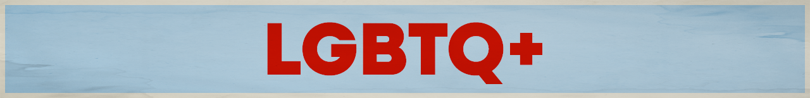

Want to pick LGBTQ+ issues as your cause? Great! Move to [step 2](../../steps/step2/README.md).

# Organizations

## 🌍 International

- [GLAAD](https://https//www.glaad.org)

  Founded in 1985, GLAAD is a non-profit organization focused on LGBTQ advocacy and cultural change. GLAAD works to ensure fair, accurate, and inclusive representation and creates national and local programs that advance LGBTQ acceptance. 

  <a href="https://bsky.app/profile/glaad.bsky.social" title="Follow on BlueSky Social">🦋 Follow</a>   

## 🇺🇸 U.S. Focused

- [Sylvia Rivera Law Project](https://srlp.org/)

  Sylvia Rivera Law Project (SRLP) works to guarantee that all people are free to self-determine their gender identity and expression, regardless of income or race, and without facing harassment, discrimination, or violence. SRLP is a collective organization founded on the understanding that gender self-determination is inextricably intertwined with racial, social and economic justice.

  ---

- [Elevated Access](https://www.elevatedaccess.org/)

  We are a non-profit organization that enables people to access healthcare by providing flights on private planes at no cost. Our volunteer pilot network transports clients seeking abortion or gender-affirming care across the United States.

  <a href="https://bsky.app/profile/elevatedaccess.bsky.social" title="Follow on BlueSky Social">🦋 Follow</a> 

  ---

- [Lambda Legal](https://www.lambdalegal.org/)

  Lambda Legal’s lawyers have won precedent-setting civil rights cases on everything from marriage equality to expressions of gender identity to health care discrimination. We never charge our clients for legal representation or advocacy, nor do we receive any government funding.

  <a href="https://bsky.app/profile/lambdalegal.bsky.social" title="Follow on BlueSky Social">🦋 Follow</a>

  ---

***A note about BlueSky:** I am providing links to BlueSky because it's algorithms are open source and transparent. Don't like your feed? You can create your own or find a feed created by a fellow user.

I encourage you to use social media platforms that are open sourced and decentralized (like [BlueSky](https://bsky.app/) or [Mastodon](https://joinmastodon.org/)). However, your organization might not have an account on these newer platforms, so go where your orgs are.  