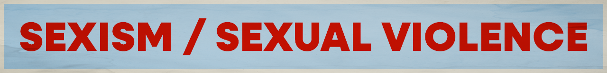

Want to pick Sexism / Sexual Violence as your cause? Great! Move to [step 2](../../steps/step2/README.md).

# Organizations

## 🌍 International

- [UN Women](https://www.unwomen.org/)

  UN Women is the UN organization delivering programmes, policies and standards that uphold women’s human rights and ensure that every woman and girl lives up to her full potential.

  ---

- [Global Fund for Women](https://www.globalfundforwomen.org/)

  We envision a world where movements for gender justice have transformed power and privilege for a few into equity and equality for all. We fund bold, ambitious, and expansive gender justice movements to create meaningful change that will last beyond our lifetimes.

    <a href="https://bsky.app/profile/globalfundwomen.bsky.social" title="Follow on BlueSky Social">🦋 Follow</a>  (not currently active, but has over 1.7k followers)

  ---

- [Advocates for Youth](https://www.advocatesforyouth.org/)

  Advocates for Youth works alongside thousands of young people here in the U.S. and around the globe as they fight for sexual health, rights, and justice.

  ---

- [Know Your IX](https://www.advocatesforyouth.org/campaigns/know-your-ix/)

  Know Your IX is youth- and survivor-led project of Advocates for Youth empower students to end gender-based and sexual violence in schools.

## 🇺🇸 U.S. Focused

- [EMILY's List](https://emilyslist.org/)

  At EMILYs List, we work to elect Democratic pro-choice women up and down the ballot and across the country with a goal of fighting for our rights and our communities.

  <a href="https://bsky.app/profile/emilyslist.bsky.social" title="Follow on BlueSky Social">🦋 Follow</a>

  ---

***A note about BlueSky:** I am providing links to BlueSky because it's algorithms are open source and transparent. Don't like your feed? You can create your own or find a feed created by a fellow user.

I encourage you to use social media platforms that are open sourced and decentralized (like [BlueSky](https://bsky.app/) or [Mastodon](https://joinmastodon.org/)). However, your organization might not have an account on these newer platforms, so go where your orgs are.  