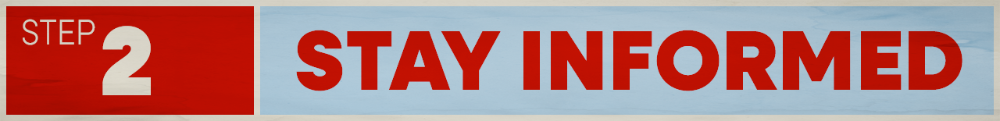
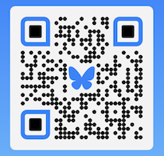

**Ready to take action? Awesome, move to [Step 3](/actions).**

# How Stay Informed

Stay informed by 
- following organizations that deal with your cause on social media,
- subscribing to their mailing lists, 
- or create a [Google Alert](https://support.google.com/websearch/answer/4815696?hl=en) to get emails when keywords about your organization and cause come up in the news.

🦋 **BlueSky Social Users**

This is a link to a [starter pack of organizations](https://go.bsky.app/8i9FuqR) that are currently on the platform.

***A note about BlueSky:** I am providing links to BlueSky because it's algorithms are open source and transparent. Don't like your feed? You can create your own or find a feed created by a fellow user.

I encourage you to use social media platforms that are open sourced and decentralized (like [BlueSky](https://bsky.app/) or [Mastodon](https://joinmastodon.org/)). However, your organization might not have an account on these newer platforms, so go where your orgs are. 

---

 

**Ready to take action? Awesome, move to [Step 3](/actions).**