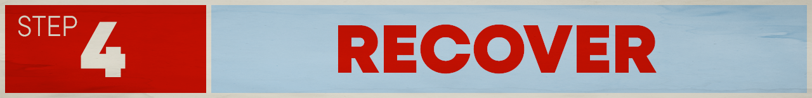

# Recovery

Remember to take care of your mental, physical, and spiritual health. We're in this for the long haul, make sure to recharge your batteries!

 The following are some examples, but by all means, do whatever works best for you.
- [How and Why You Should Take Social Media Breaks](https://summer.harvard.edu/blog/need-a-break-from-social-media-heres-why-you-should-and-how-to-do-it/)
- [Mindfulness Activities](https://www.healthline.com/health/mind-body/mindfulness-activities#for-adults)
- [Find a Fitness Routine](https://www.mayoclinic.org/healthy-lifestyle/fitness/basics/fitness-basics/hlv-20049447)
- [Make art for your mental health](https://mcpress.mayoclinic.org/living-well/the-intersection-of-art-and-health-how-art-can-help-promote-well-being/)
- [Make Sure You're Getting Good Sleep](https://hub.jhu.edu/at-work/2022/03/11/good-sleep-for-good-health/)
- [Find a game that helps you destress](https://www.engadget.com/gaming/best-relaxing-video-games-140048572.html)
- [Try meditation and/or a meditation app](https://www.headspace.com/articles/how-to-meditate-in-ten-minutes)

## Congratulations
You have completed a cycle! Once your batteries are recharged, let's do it again. Pick a new cause or complete another cycle for the same cause: [Step 1](/causes)
